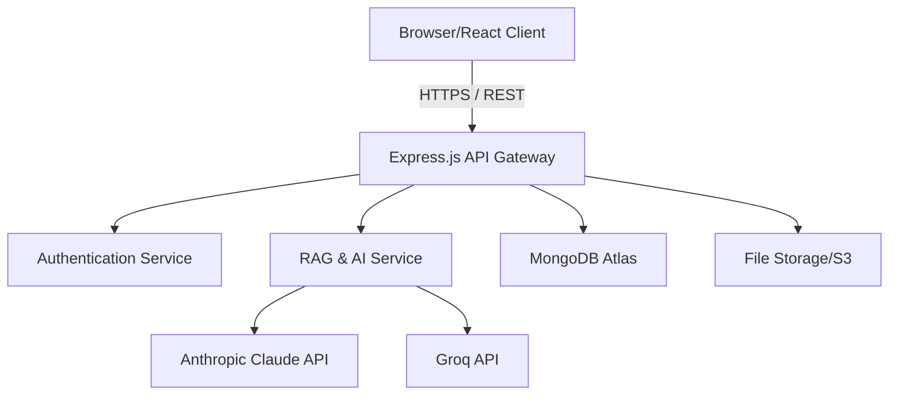

# Nexus Secure: EPC AI Intelligence Platform

Welcome to the **Nexus Secure AI Intelligence Platform for Data Centre EPC Project Delivery**. This highly detailed documentation provides an exhaustive guide to the architecture, setup, configuration, development, deployment, and operational procedures of the platform.

This document serves as the comprehensive source of truth for all engineering, product, and operational stakeholders involved in the EPC AI Platform ecosystem.

---

## Table of Contents

1. [Executive Summary](#1-executive-summary)
2. [Platform Vision and Objectives](#2-platform-vision-and-objectives)
3. [System Architecture Overview](#3-system-architecture-overview)
4. [Technology Stack Detailed Breakdown](#4-technology-stack-detailed-breakdown)
5. [Core Modules and Features](#5-core-modules-and-features)
6. [Security and Authentication Framework](#6-security-and-authentication-framework)
7. [Database Architecture and Data Models](#7-database-architecture-and-data-models)
8. [AI and Machine Learning Integration Pipeline](#8-ai-and-machine-learning-integration-pipeline)
9. [Local Development Environment Setup](#9-local-development-environment-setup)
10. [Configuration Management](#10-configuration-management)
11. [Backend Services and REST API Specification](#11-backend-services-and-rest-api-specification)
12. [Frontend Application Architecture](#12-frontend-application-architecture)
13. [Testing Strategy and Quality Assurance](#13-testing-strategy-and-quality-assurance)
14. [Deployment and DevOps Workflows](#14-deployment-and-devops-workflows)
15. [Troubleshooting and Diagnostic Playbooks](#15-troubleshooting-and-diagnostic-playbooks)
16. [Performance Optimization Guidelines](#16-performance-optimization-guidelines)
17. [Contribution Guidelines and Coding Standards](#17-contribution-guidelines-and-coding-standards)
18. [Changelog and Version History](#18-changelog-and-version-history)
19. [License and Legal Declarations](#19-license-and-legal-declarations)

---

## 1. Executive Summary

The Nexus Secure EPC AI Platform is an enterprise-grade, cloud-native application specifically engineered to revolutionize Engineering, Procurement, and Construction (EPC) processes within the highly specialized domain of Data Centre delivery. By leveraging state-of-the-art Generative AI (Anthropic Claude and Groq models), the platform automates complex engineering document analysis, enforces stringent compliance checks (such as Uptime Institute Tier III and ASHRAE standards), monitors supply chain logistics in real-time, and predicts schedule risks with unprecedented accuracy.

This platform bridges the gap between siloed construction data and actionable intelligence, empowering project managers, lead engineers, commissioning agents, and external vendors to collaborate within a unified, strictly secured environment.

---

## 2. Platform Vision and Objectives

### 2.1 The Challenge in Data Centre EPC
Data centre construction projects are notorious for their tight schedules, astronomical budgets, and zero-tolerance policies for engineering errors. A single mismatch in a submittal for an Uninterruptible Power Supply (UPS) or a Cooling Tower can lead to cascading delays and compliance failures. Traditional document review processes are manual, error-prone, and slow.

### 2.2 Our AI-Driven Solution
Our objective is to transform this reactive process into a proactive, intelligent workflow. By ingesting thousands of pages of technical specifications, vendor submittals, and commissioning checklists, our AI models act as a "Co-Pilot" for engineering teams. 

Key objectives include:
*   **Risk Mitigation:** Automatically identifying deviations in vendor submittals against baseline project specifications.
*   **Schedule Optimization:** Analyzing critical path activities and predicting delays based on historical data and supply chain constraints.
*   **Quality Assurance:** Ensuring that every component installed on-site strictly adheres to targeted compliance tiers (e.g., TIA-942 Level 4, Uptime Tier III).
*   **Supply Chain Visibility:** Tracking tier-1 and tier-2 equipment from manufacturing origin to site delivery, raising alerts for potential logistics disruptions.

---

## 3. System Architecture Overview

The system is built on a decoupled, microservices-inspired monolithic architecture, separating the client-side presentation layer from the heavy server-side processing and data persistence layers.

### 3.1 High-Level Architecture Diagram


### 3.2 Component Breakdown
*   **Presentation Layer (Frontend):** A Single Page Application (SPA) built with React and Vite, utilizing Tailwind CSS for a futuristic, dark-mode, glassmorphic aesthetic.
*   **API Layer (Backend):** A robust Node.js and Express server that handles routing, middleware execution (auth, rate-limiting, error handling), and business logic.
*   **Persistence Layer (Database):** MongoDB Atlas serves as the primary data store, utilizing document-based NoSQL architecture for flexible schema management of complex EPC data structures.
*   **Intelligence Layer (AI Integrations):** A dual-provider AI setup. Anthropic's Claude is used for deep, contextual document analysis, while Groq is leveraged for ultra-fast, high-throughput inferencing tasks.

---

## 4. Technology Stack Detailed Breakdown

### 4.1 Frontend Ecosystem
*   **Framework:** React 18+ (Functional Components, Hooks)
*   **Build Tool:** Vite (Hot Module Replacement, optimized bundling)
*   **Styling:** Tailwind CSS (Utility-first, highly customizable, design system tokens)
*   **Routing:** React Router v6
*   **State Management:** React Context API & custom hooks
*   **HTTP Client:** Axios (Interceptors for JWT attachment)
*   **Icons:** Lucide React / Heroicons

### 4.2 Backend Ecosystem
*   **Runtime:** Node.js (v18+ LTS recommended)
*   **Framework:** Express.js 4.19+
*   **Database ODM:** Mongoose 8.5+
*   **Authentication:** JSON Web Tokens (JWT) & bcryptjs for password hashing
*   **Security:** Helmet.js (HTTP headers), CORS, express-rate-limit
*   **File Parsing:** multer (upload handling), pdf-parse (text extraction)
*   **AI SDKs:** `@anthropic-ai/sdk`, `groq-sdk`

### 4.3 Database and Infrastructure
*   **Database:** MongoDB Atlas (Cloud-hosted NoSQL)
*   **Environment Configuration:** `dotenv`
*   **Process Management:** `nodemon` (development), PM2 (production recommended)

---

## 5. Core Modules and Features

The platform is divided into several specialized modules, each targeting a specific facet of EPC project delivery.

### 5.1 Dashboard Module
The central hub for project oversight. It aggregates data from all other modules to provide a birds-eye view of project health.
*   **Key Metrics:** Total active documents, unresolved compliance deviations, critical path delays, and supply chain alerts.
*   **Interactive Visualizations:** Charts and graphs depicting risk trends over time.

### 5.2 Document Management & RAG Module
The backbone of the AI functionality. It handles the ingestion, parsing, and vectorization of technical documents.
*   **Supported Formats:** PDF, TXT.
*   **Processing Pipeline:** Upload -> Text Extraction -> Chunking -> Embedding -> Vector Storage.
*   **Retrieval Augmented Generation (RAG):** When an engineer asks a question, the system retrieves relevant document chunks and provides them as context to the LLM, ensuring highly accurate and project-specific answers.

### 5.3 Compliance Analysis Module
Automates the tedious process of reviewing vendor submittals against baseline specifications.
*   **Deviation Detection:** The AI highlights exact clauses where a submittal fails to meet the specification (e.g., a UPS offering 10 minutes of runtime when the spec requires 12).
*   **Tier Verification:** Cross-references equipment specs with standard industry requirements (Uptime, TIA-942, ASHRAE).

### 5.4 Schedule Risk Management Module
Tracks critical path activities and forecasts potential delays.
*   **Activity Tracking:** Monitors planned vs. forecast start and finish dates.
*   **AI Risk Assessment:** Evaluates qualitative updates and flags activities at risk of slipping based on historical patterns or dependent supply chain issues.

### 5.5 Supply Chain Tracking Module
Provides visibility into the procurement lifecycle of critical data centre equipment.
*   **Status Monitoring:** Tracks items from "manufacturing" to "customs" to "in_transit" to "delivered".
*   **Geospatial Tracking:** Records origin and destination coordinates for key components (e.g., Switchgear from Bengaluru to Pune).
*   **Alternate Supplier Intelligence:** Maintains a database of backup vendors to mitigate single-source failure risks.

### 5.6 Commissioning Checklist Module
Digitizes the Level 3 (Subsystem) and Level 4 (System) commissioning processes.
*   **Standardized Testing:** Ensures all tests adhere to predefined standards.
*   **Real-time Status Updates:** Tracks pass/fail/pending status of critical commissioning activities.

---

## 6. Security and Authentication Framework

Security is paramount given the sensitive nature of data centre intellectual property and project financials.

### 6.1 Authentication Flow
1.  **Login Request:** User submits email and password.
2.  **Verification:** Backend normalizes email, queries MongoDB, and uses `bcrypt.compare` to validate the hash.
3.  **Token Generation:** Upon success, a JWT is signed using a robust `JWT_SECRET`. The payload includes the user ID, email, role, and tenant ID.
4.  **Token Storage:** The frontend stores this token securely (e.g., HttpOnly cookie or secure local storage mechanism).
5.  **Subsequent Requests:** Every API call includes the JWT in the `Authorization: Bearer <token>` header.

### 6.2 Role-Based Access Control (RBAC)
The system currently supports different roles, primarily `admin` and `vendor`.
*   **Admin:** Full read/write access to all modules, ability to trigger compliance checks, and manage users.
*   **Vendor:** Restricted access, primarily limited to uploading their specific submittals and viewing RFIs related to their scope of work.

### 6.3 Application Security Posture
*   **Helmet.js:** Secures Express apps by setting various HTTP headers (Content Security Policy, X-XSS-Protection, etc.).
*   **Rate Limiting:** Prevents brute-force attacks on login endpoints and protects AI API endpoints from abuse.
*   **Input Sanitization:** All incoming requests are validated to prevent NoSQL injection and XSS attacks.

---

## 7. Database Architecture and Data Models

The MongoDB schema is designed for high performance and deep relational linking where necessary.

### 7.1 User Model (`User.js`)
Stores authentication and authorization data.
*   `email` (String, Unique, Required)
*   `password` (String, Hashed)
*   `role` (String: 'admin', 'vendor')
*   `tenantId` (String, for future multi-tenancy support)

### 7.2 Document Model (`Document.js`)
Stores metadata and extracted text for all project files.
*   `title` (String)
*   `type` (String: 'specification', 'submittal', etc.)
*   `system` (String: 'Power', 'Cooling', etc.)
*   `rawText` (String, extracted content)
*   `uploadDate` (Date)

### 7.3 ScheduleRisk Model (`ScheduleRisk.js`)
Tracks project schedule health.
*   `activity` (String)
*   `plannedStart`, `plannedFinish` (Date)
*   `forecastFinish` (Date)
*   `isCriticalPath` (Boolean)

### 7.4 SupplyChainItem Model (`SupplyChainItem.js`)
Monitors equipment procurement.
*   `equipment` (String)
*   `vendor` (String)
*   `expectedDelivery` (Date)
*   `currentStatus` (String: 'manufacturing', 'in_transit', etc.)
*   `origin`, `destination` (Objects with lat/lng)

### 7.5 CommissioningChecklist Model (`CommissioningChecklist.js`)
Manages testing protocols.
*   `system` (String)
*   `phase` (String)
*   `items` (Array of sub-documents: testId, description, status)

---

## 8. AI and Machine Learning Integration Pipeline

The platform leverages a dual-provider strategy to balance capability and cost/latency.

### 8.1 Provider Selection Strategy
*   **Anthropic Claude (e.g., Claude 3.5 Sonnet):** Utilized for highly complex reasoning tasks, such as deep compliance analysis comparing dense engineering specifications against multi-page vendor submittals. Its large context window and superior logic capabilities make it ideal for this.
*   **Groq (e.g., LLaMA 3 70B):** Utilized for tasks requiring ultra-low latency, such as quick chat interactions, simple document summarization, and extracting specific data points from structured text.

### 8.2 RAG Implementation Details
1.  **Ingestion:** When a PDF is uploaded, `pdf-parse` extracts raw text.
2.  **Structuring:** The text is cleaned and potentially chunked into smaller, semantically meaningful segments.
3.  **Prompt Engineering:** The backend constructs highly specific system prompts. For compliance, the prompt provides the exact baseline specification text and the submittal text, instructing the LLM to output a structured JSON array of deviations.
4.  **Error Handling:** The AI service includes retry logic and fallback mechanisms in case an API provider experiences downtime or rate limits.

---

## 9. Local Development Environment Setup

A strictly controlled development environment ensures consistency across the engineering team.

### 9.1 Prerequisites Checklist
*   **OS:** Windows 10/11, macOS (M1/M2/Intel), or Linux (Ubuntu 20.04+).
*   **Node.js:** v18.x or v20.x (Verify with `node -v`).
*   **npm:** v9.x or higher (Verify with `npm -v`).
*   **Git:** Version control (Verify with `git --version`).
*   **MongoDB:** A MongoDB Atlas account, or a local MongoDB Server instance running on port 27017.
*   **API Keys:** Valid keys for Anthropic and Groq.

### 9.2 Repository Initialization
1.  Clone the repository:
    ```bash
    git clone https://github.com/your-org/epc-ai-platform.git
    cd epc-ai-platform
    ```
2.  Install dependencies for both frontend and backend concurrently (or separately):
    ```bash
    cd backend && npm install
    cd ../frontend && npm install
    ```

---

## 10. Configuration Management

Environment variables control the behavior of the application across different deployment environments (Dev, Staging, Prod).

### 10.1 Backend `.env` Configuration
Create a `.env` file in the `backend` directory based on `.env.example`:

```ini
# Server Configuration
PORT=5000
CLIENT_URL=http://localhost:5173

# Database Connection
# IMPORTANT: If using Atlas, ensure your IP is whitelisted!
# For local DB: MONGO_URI=mongodb://localhost:27017/epc_ai_platform
MONGO_URI=mongodb+srv://<username>:<password>@cluster0.xxxxx.mongodb.net/epc_ai_platform

# Authentication
# Use a highly secure, random string for production
JWT_SECRET=your_super_secret_jwt_key_here

# AI Provider Keys
ANTHROPIC_API_KEY=sk-ant-api03-...
CLAUDE_MODEL=claude-3-5-sonnet-20240620
GROQ_API_KEY=gsk_...
GROQ_MODEL=llama3-70b-8192
AI_PROVIDER=groq # Toggle between 'groq' or 'anthropic' for default operations
```

### 10.2 Frontend `.env` Configuration
Create a `.env` file in the `frontend` directory:

```ini
# API Gateway URL
VITE_API_URL=http://localhost:5000/api
```

---

## 11. Backend Services and REST API Specification

The Express backend exposes a comprehensive RESTful API. Below are detailed specifications for critical endpoints.

### 11.1 Authentication API (`/api/auth`)
*   **POST `/api/auth/login`**
    *   *Description:* Authenticates a user and returns a JWT.
    *   *Payload:* `{ "email": "admin@nexus.com", "password": "password123" }`
    *   *Response (200 OK):* `{ "message": "Login successful", "token": "ey...", "user": { "id": "...", "email": "...", "role": "admin" } }`
    *   *Response (401 Unauthorized):* `{ "error": "Invalid credentials" }`

### 11.2 Document API (`/api/documents`)
*   **GET `/api/documents`**
    *   *Description:* Retrieves a list of all documents. Requires Auth header.
*   **POST `/api/documents/upload`**
    *   *Description:* Uploads a new document. Must be `multipart/form-data`.
    *   *Payload:* File attachment.

### 11.3 Compliance API (`/api/compliance`)
*   **POST `/api/compliance/analyze`**
    *   *Description:* Triggers an AI analysis comparing a submittal against a spec.
    *   *Payload:* `{ "submittalId": "123", "specId": "456" }`
    *   *Response:* JSON array of detected deviations with risk scores and AI reasoning.

### 11.4 Seed Data Generation
To populate the database with realistic demo data, run the seed script:
```bash
cd backend
npm run seed
```
*Note: This will wipe existing collections and recreate demo users, documents, supply chain items, and schedule risks. Do not run in production!*

---

## 12. Frontend Application Architecture

The React frontend is architected for scalability, maintainability, and exceptional user experience.

### 12.1 Directory Structure
```
frontend/
├── src/
│   ├── assets/        # Static assets, images, SVGs
│   ├── components/    # Reusable UI components (Buttons, Cards, Modals)
│   ├── contexts/      # React Context providers (AuthContext, ThemeContext)
│   ├── hooks/         # Custom React hooks (useAuth, useFetch)
│   ├── pages/         # Page-level components (Dashboard, Login, Documents)
│   ├── services/      # API client wrappers (api.js, authService.js)
│   ├── utils/         # Helper functions (date formatting, string manipulation)
│   ├── App.jsx        # Root component and Router configuration
│   └── main.jsx       # Entry point, Context wrappers
```

### 12.2 State Management Strategy
*   **Global State:** React Context is used sparingly for truly global data, primarily user authentication state (`AuthContext`).
*   **Local State:** `useState` and `useReducer` are used for component-specific state (form inputs, modal visibility).
*   **Server State:** React Query or SWR (or custom `useEffect` hooks) handle data fetching, caching, and synchronization with the backend API.

### 12.3 Design System and Styling
Tailwind CSS dictates the design system. We enforce a strict color palette tailored for a "Nexus Secure" cyber/industrial aesthetic.
*   Primary Colors: Cyan, Teal, Deep Blue.
*   Backgrounds: Very dark grays/blacks (`bg-gray-900`, `bg-black`).
*   Typography: Modern sans-serif (Inter or similar).
*   Effects: Heavy use of backdrop filters (`backdrop-blur`), subtle borders, and neon-like text shadows for critical alerts.

---

## 13. Testing Strategy and Quality Assurance

Ensuring platform reliability requires a multi-tiered testing approach.

### 13.1 Unit Testing
*   **Backend:** Jest or Mocha/Chai for testing utility functions, database model validation, and isolated service logic (especially the AI prompt generators).
*   **Frontend:** Vitest and React Testing Library for testing pure components, hooks, and localized state logic.

### 13.2 Integration Testing
*   **API Tests:** Supertest is used to hit Express endpoints directly, verifying routing, middleware (auth), and database interactions in a test environment.

### 13.3 End-to-End (E2E) Testing
*   **Cypress/Playwright:** Used to simulate real user workflows. Critical paths tested include:
    1. User login.
    2. Navigating to the Document repository.
    3. Uploading a mock PDF.
    4. Navigating to Compliance and triggering an AI analysis.
    5. Verifying the resulting deviation report is rendered correctly.

---

## 14. Deployment and DevOps Workflows

The platform is designed to be cloud-agnostic, though Dockerization is strongly recommended for production environments.

### 14.1 Backend Deployment (Node/Express)
1.  **Environment Variables:** Ensure all production secrets (JWT_SECRET, API Keys, Production MongoDB URI) are securely injected via the hosting provider's secrets manager.
2.  **Process Management:** Use PM2 to run the Node process, enabling clustering and automatic restarts on failure.
    ```bash
    pm2 start src/server.js --name "epc-backend" -i max
    ```
3.  **Hosting Options:** AWS Elastic Beanstalk, Heroku, Render, or a containerized deployment on AWS ECS / EKS.

### 14.2 Frontend Deployment (React/Vite)
1.  **Build Process:** Run the Vite build command to generate optimized static assets.
    ```bash
    npm run build
    ```
2.  **Hosting Options:** The resulting `dist` folder can be hosted on any static file server or CDN. Vercel, Netlify, AWS S3 + CloudFront, or Firebase Hosting are highly recommended.

### 14.3 CI/CD Pipeline
GitHub Actions (or GitLab CI) should be configured to:
*   Run linting (`eslint`) on every push.
*   Execute the test suite on Pull Requests to the `main` branch.
*   Automatically deploy the frontend to a staging URL on PR creation.
*   Automatically trigger production deployments upon merging to `main`.

---

## 15. Troubleshooting and Diagnostic Playbooks

This section covers common issues encountered by developers and operators.

### 15.1 Issue: "Login failed" / `ECONNREFUSED`
**Symptom:** The frontend displays "Login failed". Backend logs show `[db] connection failed: querySrv ECONNREFUSED _mongodb._tcp...`
**Diagnosis:** The backend Node.js server cannot reach the MongoDB Atlas cluster.
**Resolution Steps:**
1.  **Check IP Whitelist:** Log into MongoDB Atlas -> Network Access. Ensure the server's (or your local machine's) IP address is added to the IP Access List. `0.0.0.0/0` allows all IPs but is a security risk.
2.  **Check Cluster Status:** Verify the Atlas cluster is active and not "paused" (common for free-tier M0 clusters after inactivity). Click "Resume" if paused.
3.  **Network Firewalls:** If working from a corporate network, port 27017 or DNS SRV queries may be blocked. Test by switching to a mobile hotspot or changing DNS to `8.8.8.8`.
4.  **Local Fallback:** If Atlas is unreachable, change `MONGO_URI` in `.env` to a local instance: `mongodb://localhost:27017/epc_ai_platform`.

### 15.2 Issue: AI API Rate Limits or Timeouts
**Symptom:** Compliance analysis takes extremely long or returns a 500 error.
**Diagnosis:** The chosen AI provider (Anthropic/Groq) is experiencing high latency, or your API key has hit a rate limit (HTTP 429).
**Resolution Steps:**
1.  Check provider status pages (status.anthropic.com, status.groq.com).
2.  Implement exponential backoff retry logic in `ragService.js`.
3.  Ensure your API keys are valid and have sufficient billing credits.

### 15.3 Issue: Frontend Fails to Connect to Backend
**Symptom:** API calls fail, console shows CORS errors or "Failed to fetch".
**Diagnosis:** The `VITE_API_URL` is incorrect, or the backend CORS configuration is blocking the frontend origin.
**Resolution Steps:**
1.  Verify `VITE_API_URL` in `frontend/.env` matches the backend's address (e.g., `http://localhost:5000/api`).
2.  Verify `CLIENT_URL` in `backend/.env` matches the frontend's address (e.g., `http://localhost:5173`).
3.  Check the `cors` middleware setup in `backend/src/server.js`.

---

## 16. Performance Optimization Guidelines

As the platform scales, optimizing both frontend and backend is critical.

### 16.1 Backend Optimizations
*   **Database Indexing:** Ensure frequently queried fields (e.g., `email` in Users, `system` in Documents) have appropriate MongoDB indexes to prevent full collection scans.
*   **Caching:** Implement Redis for caching frequent, heavy queries (e.g., the aggregated dashboard statistics) to reduce database load.
*   **Pagination:** All listing endpoints (Documents, Supply Chain items) must implement pagination (limit/offset) to handle large datasets.

### 16.2 Frontend Optimizations
*   **Code Splitting:** Use React `lazy` and `Suspense` to split the bundle by route, ensuring the initial load only downloads necessary code.
*   **Memoization:** Liberally use `useMemo` and `useCallback` to prevent unnecessary re-renders of complex dashboard charts and heavy data tables.
*   **Image Optimization:** Compress all static assets and utilize modern formats like WebP.

---

## 17. Contribution Guidelines and Coding Standards

We welcome contributions to the EPC AI Platform. Please adhere to the following standards to maintain code quality.

### 17.1 Git Workflow
1.  **Branching:** Create feature branches off `develop` (e.g., `feature/add-rfi-module`, `bugfix/fix-login-cors`).
2.  **Commits:** Use conventional commits format (e.g., `feat: add PDF parsing service`, `fix: resolve ECONNREFUSED on db connect`).
3.  **Pull Requests:** Submit PRs against the `develop` branch. Ensure all tests pass and require at least one code review approval before merging.

### 17.2 Coding Standards
*   **JavaScript:** Enforce ES6+ syntax. Use `async/await` exclusively instead of `.then()` chains. Avoid `var`; use `const` (preferred) and `let`.
*   **Linting:** Prettier and ESLint are mandatory. Ensure your IDE is configured to format on save.
*   **Documentation:** All complex functions, especially within the AI and RAG services, must have JSDoc comments explaining parameters, return types, and expected behavior.

---

## 18. Changelog and Version History

### v1.0.0 (Initial Release)
*   Implemented core monolithic backend structure.
*   Integrated React/Vite frontend with Tailwind CSS design system.
*   Built Authentication (JWT) and RBAC foundation.
*   Developed MongoDB schemas for Documents, Risks, Supply Chain, and Checklists.
*   Integrated Anthropic Claude and Groq APIs for compliance analysis.
*   Added `seed.js` script for demo data population.

---

## 19. License and Legal Declarations

Copyright (c) 2026 Nexus Secure Innovations. All Rights Reserved.

This software and associated documentation files (the "Software") are proprietary and confidential. Unauthorized copying, distribution, or modification of this file, via any medium, is strictly prohibited. The Software is provided "AS IS", without warranty of any kind, express or implied, including but not limited to the warranties of merchantability, fitness for a particular purpose and noninfringement. In no event shall the authors or copyright holders be liable for any claim, damages or other liability, whether in an action of contract, tort or otherwise, arising from, out of or in connection with the Software or the use or other dealings in the Software.

---

*End of Nexus Secure EPC AI Intelligence Platform Documentation.*
